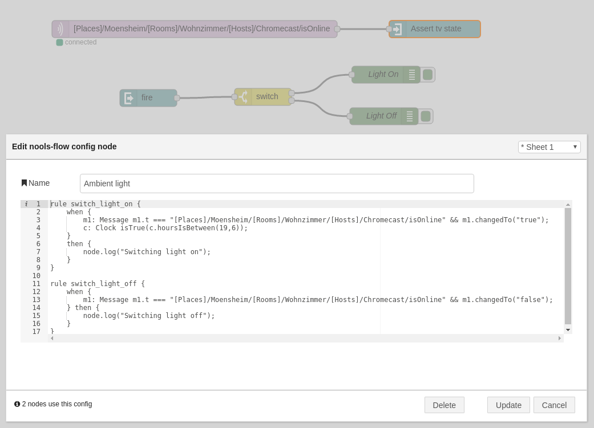

# Nools rule engine for Node-RED
This package provides a rule engine for node-RED. It uses nools, a rete-based rule engine. You can create custom __flows__ with multiple rules, the flow is bind to one or more __assert__ nodes to insert new __facts__ into the flow. Each __fact__ is of type `Message` and identified by the `msg.topic` of the incoming node-RED message. If a message already exists with the same topic it will be updated. New messages will be asserted. If all conditions of a rule are evaluated the rule will be fired. The __fire__ node outputs the rule name into your node-RED flow. The message object provides different functions and properties. There is also a `Clock` class which is available.

You can use the `publish({topic: "sometopic", payload: "somepayload"})` to publish messages via the __fire__ node. The __topic__ property of the node operates as a filter.

### Message
##### `Message.payload` or `Message.p`
The current payload
##### `Message.topic` or `Message.t`
The topic and identifier of the message object
##### `Message.changed`
`true` if the `msg.payload` changed
##### `Message.currentChange`
timestamp of the change
##### `Message.lastChange`
timestamp of the previous change
##### `Message.changedFromTo(from,to)`
Returns `true` if the `msg.payload` changed from `from` to `to`
##### `Message.changedTo(to)`
Returns `true` if the `msg.payload` changed to `to` from any
##### `Message.changedFrom(from)`
Returns `true` if the `msg.payload` changed from `from` to any
### Clock
##### `Clock.getHours()`
##### `Clock.getMinutes()`
##### `Clock.hoursIsBetween(h1, h2)`

## Example


## Installation
Just install this plugin in your Node-RED folder by using npm:

```bash
npm install node-red-contrib-nools
```

Or if you have installed Node-RED globally use:

```bash
npm install -g node-red-contrib-nools
```

## Contributing
1. Fork it!
2. Create your feature branch: `git checkout -b my-new-feature`
3. Commit your changes: `git commit -am 'Add some feature'`
4. Push to the branch: `git push origin my-new-feature`
5. Submit a pull request :D

## History

## Credits
Jochen Scheib

Inspired by __Robert Hekkers__:
http://blog.hekkers.net/2014/06/30/making-a-scene/

## License
MIT
